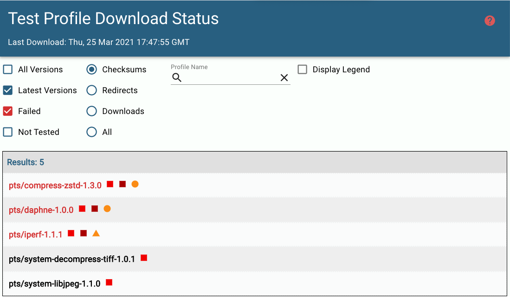

# Test Profile Download Status

#### Part of [Phoronix Test Suite](https://www.phoronix-test-suite.com/)

Test Profile Download Status is a tool for displaying the download status of each Test Profile within the Phoronix Test Suite.

## Features

- Display the status of All Versions or just the Latest Version of each Test Profile
- Display specific failures such as checksum, redirect and HTTP reponse code
- Search for the status of a given Test Profile
- Visualize Type and Status of each error though colors and signifiers

To use this feature, visit the [Test Profile Download Status](https://tippettj.github.io/phoronix-stats/index.html) page.

